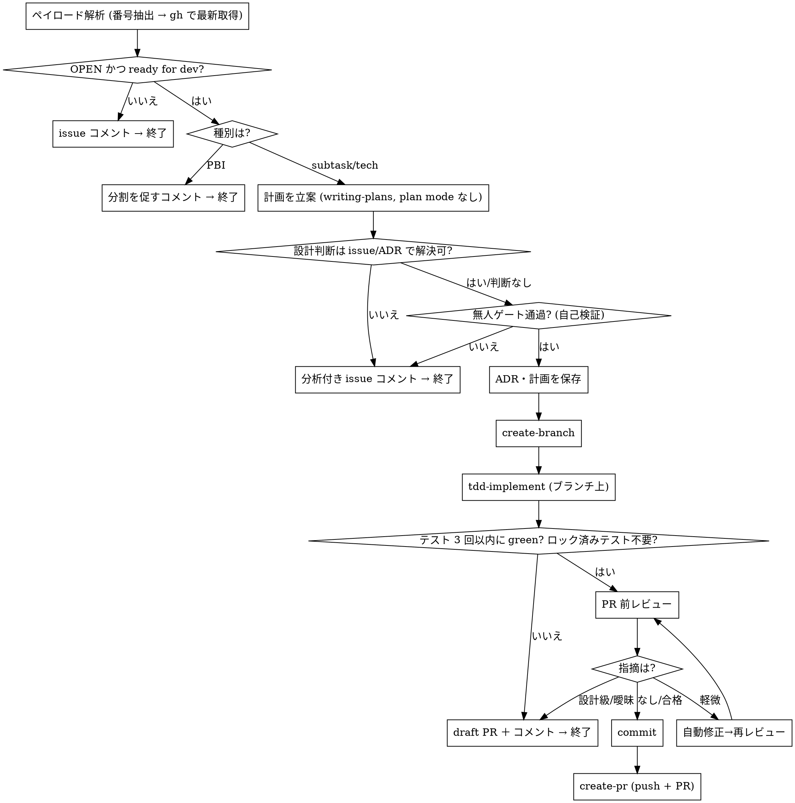

# 判断フロー（迷いやすい分岐）

```dot
digraph cloud_issue_to_pr {
    "ペイロード解析 (番号抽出 → gh で最新取得)" [shape=box];
    "OPEN かつ ready for dev?" [shape=diamond];
    "issue コメント → 終了" [shape=box];
    "種別は?" [shape=diamond];
    "分割を促すコメント → 終了" [shape=box];
    "計画を立案 (writing-plans, plan mode なし)" [shape=box];
    "設計判断は issue/ADR で解決可?" [shape=diamond];
    "分析付き issue コメント → 終了" [shape=box];
    "無人ゲート通過? (自己検証)" [shape=diamond];
    "ADR・計画を保存" [shape=box];
    "create-branch" [shape=box];
    "tdd-implement (ブランチ上)" [shape=box];
    "テスト 3 回以内に green? ロック済みテスト不要?" [shape=diamond];
    "draft PR ＋ コメント → 終了" [shape=box];
    "PR 前レビュー" [shape=box];
    "指摘は?" [shape=diamond];
    "自動修正→再レビュー" [shape=box];
    "commit" [shape=box];
    "create-pr (push + PR)" [shape=box];

    "ペイロード解析 (番号抽出 → gh で最新取得)" -> "OPEN かつ ready for dev?";
    "OPEN かつ ready for dev?" -> "issue コメント → 終了" [label="いいえ"];
    "OPEN かつ ready for dev?" -> "種別は?" [label="はい"];
    "種別は?" -> "分割を促すコメント → 終了" [label="PBI"];
    "種別は?" -> "計画を立案 (writing-plans, plan mode なし)" [label="subtask/tech"];
    "計画を立案 (writing-plans, plan mode なし)" -> "設計判断は issue/ADR で解決可?";
    "設計判断は issue/ADR で解決可?" -> "分析付き issue コメント → 終了" [label="いいえ"];
    "設計判断は issue/ADR で解決可?" -> "無人ゲート通過? (自己検証)" [label="はい/判断なし"];
    "無人ゲート通過? (自己検証)" -> "分析付き issue コメント → 終了" [label="いいえ"];
    "無人ゲート通過? (自己検証)" -> "ADR・計画を保存" [label="はい"];
    "ADR・計画を保存" -> "create-branch";
    "create-branch" -> "tdd-implement (ブランチ上)";
    "tdd-implement (ブランチ上)" -> "テスト 3 回以内に green? ロック済みテスト不要?";
    "テスト 3 回以内に green? ロック済みテスト不要?" -> "draft PR ＋ コメント → 終了" [label="いいえ"];
    "テスト 3 回以内に green? ロック済みテスト不要?" -> "PR 前レビュー" [label="はい"];
    "PR 前レビュー" -> "指摘は?";
    "指摘は?" -> "自動修正→再レビュー" [label="軽微"];
    "自動修正→再レビュー" -> "PR 前レビュー";
    "指摘は?" -> "draft PR ＋ コメント → 終了" [label="設計級/曖昧"];
    "指摘は?" -> "commit" [label="なし/合格"];
    "commit" -> "create-pr (push + PR)";
}
```
