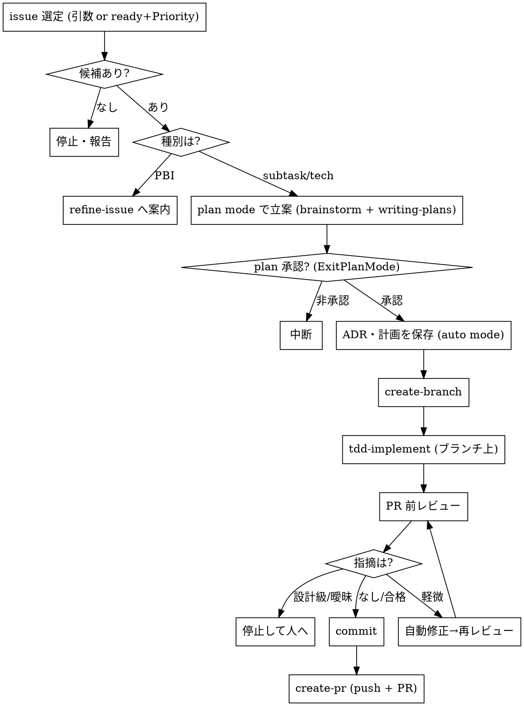

# 判断フロー（迷いやすい分岐）

```dot
digraph issue_to_pr {
    "issue 選定 (引数 or ready+Priority)" [shape=box];
    "候補あり?" [shape=diamond];
    "停止・報告" [shape=box];
    "種別は?" [shape=diamond];
    "refine-issue へ案内" [shape=box];
    "plan mode で立案 (brainstorm + writing-plans)" [shape=box];
    "plan 承認? (ExitPlanMode)" [shape=diamond];
    "中断" [shape=box];
    "ADR・計画を保存 (auto mode)" [shape=box];
    "create-branch" [shape=box];
    "tdd-implement (ブランチ上)" [shape=box];
    "PR 前レビュー" [shape=box];
    "指摘は?" [shape=diamond];
    "自動修正→再レビュー" [shape=box];
    "停止して人へ" [shape=box];
    "commit" [shape=box];
    "create-pr (push + PR)" [shape=box];

    "issue 選定 (引数 or ready+Priority)" -> "候補あり?";
    "候補あり?" -> "停止・報告" [label="なし"];
    "候補あり?" -> "種別は?" [label="あり"];
    "種別は?" -> "refine-issue へ案内" [label="PBI"];
    "種別は?" -> "plan mode で立案 (brainstorm + writing-plans)" [label="subtask/tech"];
    "plan mode で立案 (brainstorm + writing-plans)" -> "plan 承認? (ExitPlanMode)";
    "plan 承認? (ExitPlanMode)" -> "中断" [label="非承認"];
    "plan 承認? (ExitPlanMode)" -> "ADR・計画を保存 (auto mode)" [label="承認"];
    "ADR・計画を保存 (auto mode)" -> "create-branch";
    "create-branch" -> "tdd-implement (ブランチ上)";
    "tdd-implement (ブランチ上)" -> "PR 前レビュー";
    "PR 前レビュー" -> "指摘は?";
    "指摘は?" -> "自動修正→再レビュー" [label="軽微"];
    "自動修正→再レビュー" -> "PR 前レビュー";
    "指摘は?" -> "停止して人へ" [label="設計級/曖昧"];
    "指摘は?" -> "commit" [label="なし/合格"];
    "commit" -> "create-pr (push + PR)";
}
```
