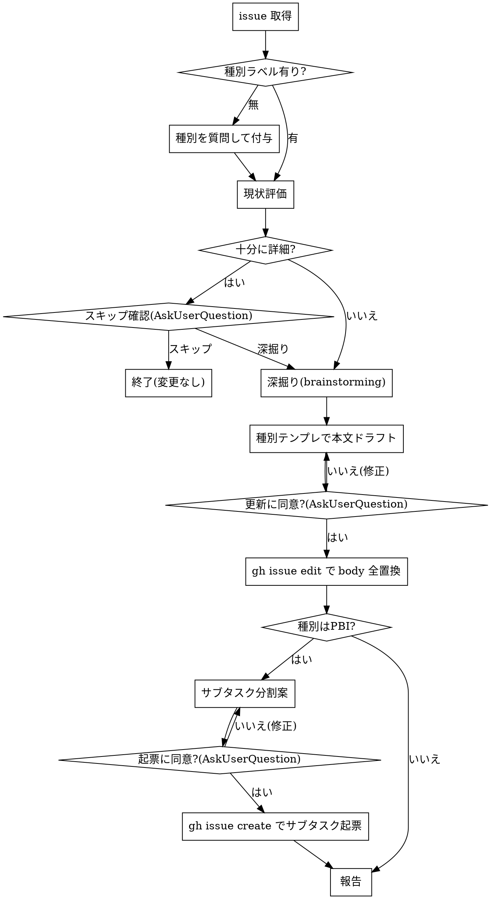

# 同意ゲート（迷いやすい分岐）

```dot
digraph refine_issue {
    "issue 取得" [shape=box];
    "種別ラベル有り?" [shape=diamond];
    "種別を質問して付与" [shape=box];
    "現状評価" [shape=box];
    "十分に詳細?" [shape=diamond];
    "スキップ確認(AskUserQuestion)" [shape=diamond];
    "終了(変更なし)" [shape=box];
    "深掘り(brainstorming)" [shape=box];
    "種別テンプレで本文ドラフト" [shape=box];
    "更新に同意?(AskUserQuestion)" [shape=diamond];
    "gh issue edit で body 全置換" [shape=box];
    "種別はPBI?" [shape=diamond];
    "サブタスク分割案" [shape=box];
    "起票に同意?(AskUserQuestion)" [shape=diamond];
    "gh issue create でサブタスク起票" [shape=box];
    "報告" [shape=box];

    "issue 取得" -> "種別ラベル有り?";
    "種別ラベル有り?" -> "種別を質問して付与" [label="無"];
    "種別ラベル有り?" -> "現状評価" [label="有"];
    "種別を質問して付与" -> "現状評価";
    "現状評価" -> "十分に詳細?";
    "十分に詳細?" -> "スキップ確認(AskUserQuestion)" [label="はい"];
    "十分に詳細?" -> "深掘り(brainstorming)" [label="いいえ"];
    "スキップ確認(AskUserQuestion)" -> "終了(変更なし)" [label="スキップ"];
    "スキップ確認(AskUserQuestion)" -> "深掘り(brainstorming)" [label="深掘り"];
    "深掘り(brainstorming)" -> "種別テンプレで本文ドラフト";
    "種別テンプレで本文ドラフト" -> "更新に同意?(AskUserQuestion)";
    "更新に同意?(AskUserQuestion)" -> "種別テンプレで本文ドラフト" [label="いいえ(修正)"];
    "更新に同意?(AskUserQuestion)" -> "gh issue edit で body 全置換" [label="はい"];
    "gh issue edit で body 全置換" -> "種別はPBI?";
    "種別はPBI?" -> "報告" [label="いいえ"];
    "種別はPBI?" -> "サブタスク分割案" [label="はい"];
    "サブタスク分割案" -> "起票に同意?(AskUserQuestion)";
    "起票に同意?(AskUserQuestion)" -> "サブタスク分割案" [label="いいえ(修正)"];
    "起票に同意?(AskUserQuestion)" -> "gh issue create でサブタスク起票" [label="はい"];
    "gh issue create でサブタスク起票" -> "報告";
}
```
