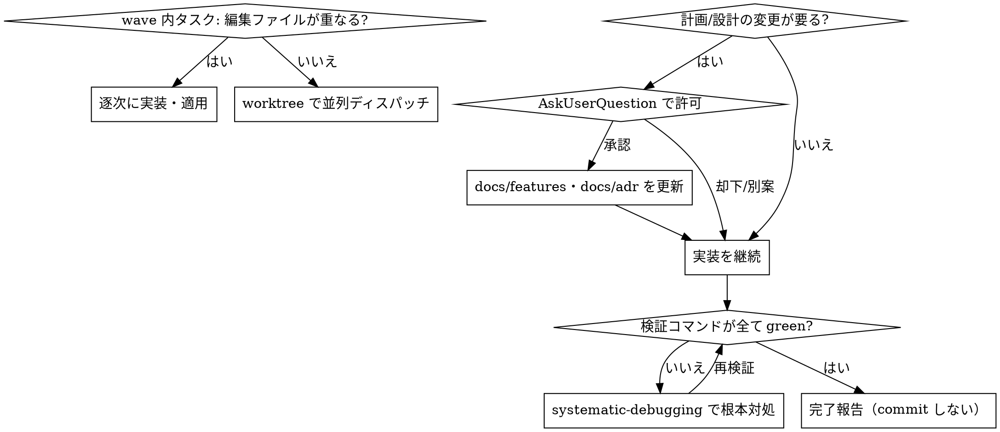

# 判断フロー（迷いやすい分岐）

```dot
digraph tdd_implement {
    "wave 内タスク: 編集ファイルが重なる?" [shape=diamond];
    "逐次に実装・適用" [shape=box];
    "worktree で並列ディスパッチ" [shape=box];
    "計画/設計の変更が要る?" [shape=diamond];
    "AskUserQuestion で許可" [shape=diamond];
    "docs/features・docs/adr を更新" [shape=box];
    "実装を継続" [shape=box];
    "検証コマンドが全て green?" [shape=diamond];
    "systematic-debugging で根本対処" [shape=box];
    "完了報告（commit しない）" [shape=box];

    "wave 内タスク: 編集ファイルが重なる?" -> "逐次に実装・適用" [label="はい"];
    "wave 内タスク: 編集ファイルが重なる?" -> "worktree で並列ディスパッチ" [label="いいえ"];
    "計画/設計の変更が要る?" -> "AskUserQuestion で許可" [label="はい"];
    "AskUserQuestion で許可" -> "docs/features・docs/adr を更新" [label="承認"];
    "AskUserQuestion で許可" -> "実装を継続" [label="却下/別案"];
    "docs/features・docs/adr を更新" -> "実装を継続";
    "計画/設計の変更が要る?" -> "実装を継続" [label="いいえ"];
    "実装を継続" -> "検証コマンドが全て green?";
    "検証コマンドが全て green?" -> "systematic-debugging で根本対処" [label="いいえ"];
    "systematic-debugging で根本対処" -> "検証コマンドが全て green?" [label="再検証"];
    "検証コマンドが全て green?" -> "完了報告（commit しない）" [label="はい"];
}
```
